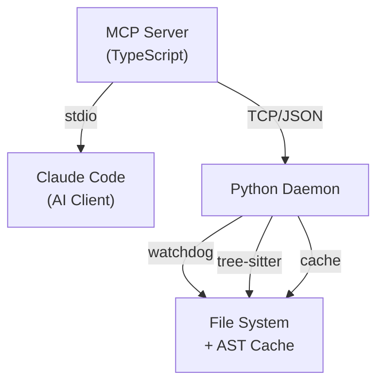

# RLM Navigator

Token-efficient codebase navigation for AI-assisted coding. Treats codebases as navigable hierarchical trees of AST skeletons — the AI sees structure first, drills into implementations only when needed. A file-watching daemon caches AST structures, a stateful REPL with dependency-aware staleness tracking provides targeted analysis, and automatic output truncation keeps every tool response within budget.

## Problem

AI coding assistants treat source files as opaque text blobs. Every interaction starts the same way: read the whole file, scan for the relevant section, discard the rest. This is fundamentally wasteful because source code is *structured* — it has a hierarchy (modules → classes → methods → statements) that can be navigated without reading implementations.

The cost compounds quickly:

- **Context Bloat**: A 500-line file consumes ~2,000 tokens even when you only need one function. Across a multi-file task, the window fills with irrelevant code that the model must attend to on every generation step.
- **Context Rot**: LLM attention degrades over long contexts. Important instructions and earlier findings get diluted as the window fills with raw source. The model "forgets" what it already learned — not because the tokens are gone, but because attention is spread too thin.
- **Exploration Loops**: Without structural summaries, the AI has no compact representation of what a file contains. It re-reads files it already saw, or reads adjacent files speculatively, burning tokens on redundant I/O.
- **Stale Data**: Results stored in variables go stale when underlying files change. Without tracking, the AI operates on outdated information — a silent correctness problem that's worse than wasted tokens.

The root cause is a mismatch between how code is organized (hierarchical, structured) and how AI tools access it (flat, full-text). RLM Navigator closes this gap by exposing code structure as a first-class navigation primitive.

## Solution

RLM Navigator provides 10 MCP tools that enforce a surgical navigation workflow:

**Navigation tools:**

| Tool | Purpose |
|------|---------|
| `get_status` | Check daemon health |
| `rlm_tree` | See directory structure (replaces ls/find) |
| `rlm_map` | See file signatures only (replaces cat/read) |
| `rlm_drill` | Read specific symbol implementation |
| `rlm_search` | Find symbols across files |

**REPL tools** (stateful Python environment with pickle persistence):

| Tool | Purpose |
|------|---------|
| `rlm_repl_init` | Initialize the stateful REPL |
| `rlm_repl_exec` | Execute Python code (variables persist across calls) |
| `rlm_repl_status` | Check variables, buffers, execution count + staleness warnings |
| `rlm_repl_reset` | Clear all REPL state |
| `rlm_repl_export` | Export accumulated buffers |

Built-in REPL helpers: `peek()` (read lines), `grep()` (regex search), `chunk_indices()` / `write_chunks()` (file chunking), `add_buffer()` (accumulate findings). All helpers automatically track file dependencies — when source files change, stale variables and buffers are flagged in `repl_status` and `repl_exec` output.

The workflow: **tree → map → drill → edit**. For complex analysis: **init → exec with helpers → export buffers**. Each step loads only what's needed.

## Architecture



## Quick Start

```bash
npx rlm-navigator@latest install
```

This copies the daemon and server into a local `.rlm/` directory, installs dependencies, builds the MCP server, and registers with Claude Code. The daemon **auto-starts** when Claude Code connects — no separate terminal needed.

### Other Commands

```bash
npx rlm-navigator@latest update    # Update to latest version
npx rlm-navigator status            # Check daemon health
npx rlm-navigator uninstall         # Remove from project
```

### Manual / Development Setup

```bash
# 1. Install Python deps
pip install -r daemon/requirements.txt

# 2. Build MCP server
cd server && npm install && npm run build

# 3. Register with Claude Code
claude mcp add rlm-navigator -- node /path/to/server/build/index.js

# 4. Start the daemon (in a separate terminal)
python daemon/rlm_daemon.py --root /path/to/your/project
```

Legacy install scripts (`install.sh`, `install.ps1`) are still available for development.

## Supported Languages

Tree-sitter powered parsing for: **Python, JavaScript, TypeScript, Go, Rust, Java, C, C++**

Unsupported file types get a graceful fallback (first 20 lines + line count).

## Benchmarks

`benchmark.py` supports four modes that measure different aspects of token efficiency.

### Workflow: Navigation Overhead

Compares "grep + full file reads" vs "tree → search → map → drill". Benchmarked against [tiangolo/fastapi](https://github.com/tiangolo/fastapi):

| Query | Approach | Files | Tokens | Reduction | Efficiency |
|---|---|---|---|---|---|
| `authenticate` | Traditional | 42 full reads | 47,131 | — | — |
| `authenticate` | RLM (full repo tree) | 9 maps | 19,109 | 59% | 2.5x |
| `authenticate` | RLM (targeted tree) | 9 maps | **8,364** | **82%** | **5.6x** |
| `OAuth2PasswordBearer` | Traditional | 20 full reads | 25,725 | — | — |
| `OAuth2PasswordBearer` | RLM (targeted tree) | 1 map | **3,267** | **87%** | **7.9x** |

Self-benchmark (this repo, query `squeeze`):

| Approach | Files | Tokens | Reduction |
|---|---|---|---|
| Traditional | 6 full reads | 22,139 | — |
| RLM | 5 maps + 5 drills | **3,358** | **85% (6.6x)** |

Scoping `rlm_tree` to the relevant subdirectory (`--tree-path fastapi/security`) is critical for large repos — it reduces tree overhead from ~11K tokens to 205, making the difference between 2-3x and **6-8x** savings.

### REPL: Targeted Analysis

Compares full file reads vs REPL-assisted grep + peek windows. Self-benchmark (query `handle_request`):

| Approach | Tokens | Reduction |
|---|---|---|
| Traditional (4 full reads) | 15,594 | — |
| REPL (grep + peek) | **16** | **~100% (974x)** |

The REPL's `grep()` returns only matching lines with file/line references — no need to read surrounding context unless you choose to `peek()` a specific range.

### Truncation: Response Capping

Measures how much the 8,000-char truncation cap saves across all tool responses. For well-structured codebases where skeletons are concise, truncation rarely activates — but for large files or verbose tree outputs it prevents runaway token consumption.

### Chunks: Skeleton vs Full-File vs Per-Chunk

Compares the cost of reading a file three ways: full text, skeleton only, and chunked windows. Self-benchmark (`daemon/rlm_daemon.py`, 397 lines):

| Approach | Tokens | Savings vs Full |
|---|---|---|
| Full file read | 3,332 | — |
| Skeleton (`rlm_map`) | 492 | **85%** |

```bash
# Run benchmarks yourself
python benchmark.py --root /path/to/project --query "symbol"                     # workflow
python benchmark.py --root /path/to/project --query "symbol" --mode truncation   # truncation
python benchmark.py --root /path/to/project --query "symbol" --mode repl         # repl
python benchmark.py --root /path/to/project --file "src/file.py" --mode chunks   # chunks
```

## Configuration

| Environment Variable | Default | Description |
|---------------------|---------|-------------|
| `RLM_DAEMON_PORT` | `9177` | TCP port for daemon communication |
| `RLM_MAX_RESPONSE` | `8000` | Max chars before output truncation |

## Development

```bash
# Run tests
cd daemon && python -m pytest tests/ -v

# Start daemon in dev mode
python daemon/rlm_daemon.py --root .
```

## How It Works

1. **Daemon** watches your project with `watchdog`, parses files with `tree-sitter`, caches AST skeletons. File change events propagate to both the skeleton cache and the REPL's dependency tracker.
2. **REPL** provides a pickle-persisted Python environment with codebase helpers (peek, grep, chunking, buffers). Tracks file dependencies per variable/buffer via mtime snapshots — when files change, staleness warnings surface automatically.
3. **MCP Server** bridges Claude Code to the daemon via TCP JSON protocol, with automatic output truncation and staleness warning formatting.
4. **Skill** enforces the navigation workflow (tree → map → drill → edit) and the chunk-delegate-synthesize workflow for large analyses.
5. **Sub-agent** (Haiku) analyzes file chunks with structured output — relevance rankings, missing items, and suggested next queries.

## Inspired By

- [brainqub3/claude_code_RLM](https://github.com/brainqub3/claude_code_RLM) — RLM for document navigation
- Tree-sitter — universal AST parsing
