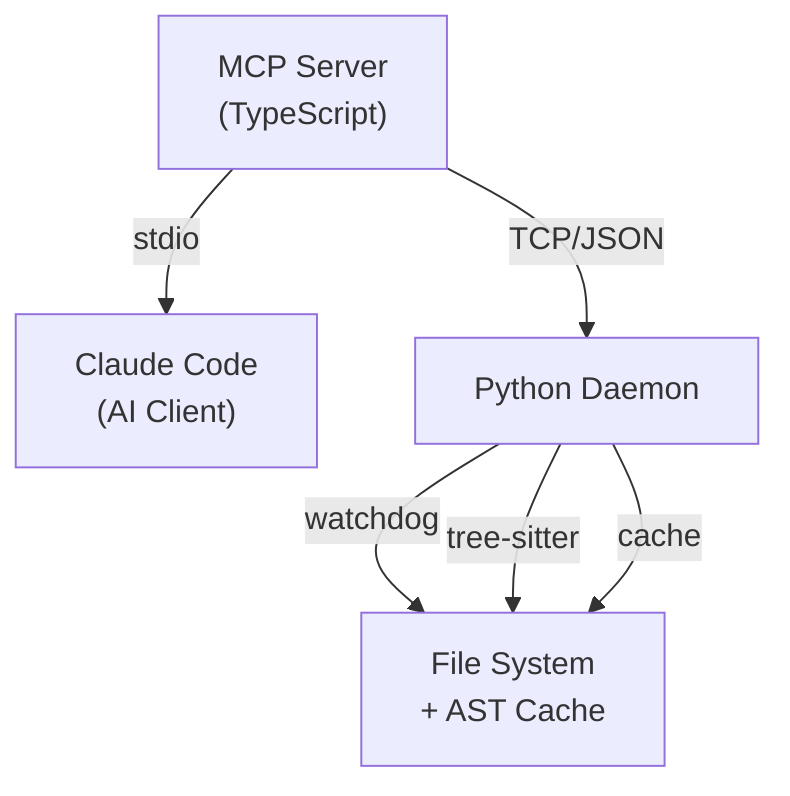

<p align="center">
  
</p>

# RLM Navigator

Token-efficient codebase navigation for AI-assisted coding. Treats codebases as navigable hierarchical trees of AST skeletons — the AI sees structure first, drills into implementations only when needed. A file-watching daemon caches AST structures, a stateful REPL with dependency-aware staleness tracking provides targeted analysis, and automatic output truncation keeps every tool response within budget.

## Problem

AI coding assistants treat source files as opaque text blobs. Every interaction starts the same way: read the whole file, scan for the relevant section, discard the rest. This is fundamentally wasteful because source code is *structured* — it has a hierarchy (modules → classes → methods → statements) that can be navigated without reading implementations.

The cost compounds quickly:

- **Context Bloat**: A 500-line file consumes ~2,000 tokens even when you only need one function. Across a multi-file task, the window fills with irrelevant code that the model must attend to on every generation step.
- **Context Rot**: LLM attention degrades over long contexts. Important instructions and earlier findings get diluted as the window fills with raw source. The model "forgets" what it already learned — not because the tokens are gone, but because attention is spread too thin.
- **Exploration Loops**: Without structural summaries, the AI has no compact representation of what a file contains. It re-reads files it already saw, or reads adjacent files speculatively, burning tokens on redundant I/O.
- **Stale Data**: Results stored in variables go stale when underlying files change. Without tracking, the AI operates on outdated information — a silent correctness problem that's worse than wasted tokens.

The root cause is a mismatch between how code is organized (hierarchical, structured) and how AI tools access it (flat, full-text). RLM Navigator closes this gap by exposing code structure as a first-class navigation primitive.

## Solution

RLM Navigator provides 10 MCP tools that enforce a surgical navigation workflow:

**Navigation tools:**

| Tool | Purpose |
|------|---------|
| `get_status` | Check daemon health |
| `rlm_tree` | See directory structure (replaces ls/find) |
| `rlm_map` | See file signatures only (replaces cat/read) |
| `rlm_drill` | Read specific symbol implementation |
| `rlm_search` | Find symbols across files |

**REPL tools** (stateful Python environment with pickle persistence):

| Tool | Purpose |
|------|---------|
| `rlm_repl_init` | Initialize the stateful REPL |
| `rlm_repl_exec` | Execute Python code (variables persist across calls) |
| `rlm_repl_status` | Check variables, buffers, execution count + staleness warnings |
| `rlm_repl_reset` | Clear all REPL state |
| `rlm_repl_export` | Export accumulated buffers |

Built-in REPL helpers: `peek()` (read lines), `grep()` (regex search), `chunk_indices()` / `write_chunks()` (file chunking), `add_buffer()` (accumulate findings). All helpers automatically track file dependencies — when source files change, stale variables and buffers are flagged in `repl_status` and `repl_exec` output.

The workflow: **tree → map → drill → edit**. For complex analysis: **init → exec with helpers → export buffers**. Each step loads only what's needed.

## Architecture


```mermaid
graph TB
    MCP["MCP Server<br/>(TypeScript)"]
    Client["Claude Code<br/>(AI Client)"]
    Daemon["Python Daemon"]
    FS["File System<br/>+ AST Cache"]

    MCP -->|stdio| Client
    MCP -->|TCP/JSON| Daemon
    Daemon -->|watchdog| FS
    Daemon -->|tree-sitter| FS
    Daemon -->|cache| FS
```

## Quick Start

```bash
npx rlm-navigator@latest install
```

This copies the daemon and server into a local `.rlm/` directory, installs dependencies, builds the MCP server, and registers with Claude Code. The daemon **auto-starts** when Claude Code connects — no separate terminal needed.

### Other Commands

```bash
npx rlm-navigator@latest update    # Update to latest version
npx rlm-navigator status            # Check daemon health
npx rlm-navigator uninstall         # Remove from project
```

### Manual / Development Setup

```bash
# 1. Install Python deps
pip install -r daemon/requirements.txt

# 2. Build MCP server
cd server && npm install && npm run build

# 3. Register with Claude Code
claude mcp add rlm-navigator -- node /path/to/server/build/index.js

# 4. Start the daemon (in a separate terminal)
python daemon/rlm_daemon.py --root /path/to/your/project
```

Legacy install scripts (`install.sh`, `install.ps1`) are still available for development.

## Supported Languages

Tree-sitter powered parsing for: **Python, JavaScript, TypeScript, Go, Rust, Java, C, C++**

Unsupported file types get a graceful fallback (first 20 lines + line count).

## Benchmarks

`benchmark.py` supports four modes that measure different aspects of token efficiency.

### Workflow: Navigation Overhead

Compares "grep + full file reads" vs "tree → search → map → drill". Benchmarked against [tiangolo/fastapi](https://github.com/tiangolo/fastapi):

| Query | Approach | Files | Tokens | Reduction | Efficiency |
|---|---|---|---|---|---|
| `authenticate` | Traditional | 42 full reads | 47,131 | — | — |
| `authenticate` | RLM (full repo tree) | 9 maps | 19,109 | 59% | 2.5x |
| `authenticate` | RLM (targeted tree) | 9 maps | **8,364** | **82%** | **5.6x** |
| `OAuth2PasswordBearer` | Traditional | 20 full reads | 25,725 | — | — |
| `OAuth2PasswordBearer` | RLM (targeted tree) | 1 map | **3,267** | **87%** | **7.9x** |

Self-benchmark (this repo, query `squeeze`):

| Approach | Files | Tokens | Reduction |
|---|---|---|---|
| Traditional | 6 full reads | 22,139 | — |
| RLM | 5 maps + 5 drills | **3,358** | **85% (6.6x)** |

Scoping `rlm_tree` to the relevant subdirectory (`--tree-path fastapi/security`) is critical for large repos — it reduces tree overhead from ~11K tokens to 205, making the difference between 2-3x and **6-8x** savings.

### REPL: Targeted Analysis

Compares full file reads vs REPL-assisted grep + peek windows. Self-benchmark (query `handle_request`):

| Approach | Tokens | Reduction |
|---|---|---|
| Traditional (4 full reads) | 15,594 | — |
| REPL (grep + peek) | **16** | **~100% (974x)** |

The REPL's `grep()` returns only matching lines with file/line references — no need to read surrounding context unless you choose to `peek()` a specific range.

### Truncation: Response Capping

Measures how much the 8,000-char truncation cap saves across all tool responses. For well-structured codebases where skeletons are concise, truncation rarely activates — but for large files or verbose tree outputs it prevents runaway token consumption.

### Chunks: Skeleton vs Full-File vs Per-Chunk

Compares the cost of reading a file three ways: full text, skeleton only, and chunked windows. Self-benchmark (`daemon/rlm_daemon.py`, 397 lines):

| Approach | Tokens | Savings vs Full |
|---|---|---|
| Full file read | 3,332 | — |
| Skeleton (`rlm_map`) | 492 | **85%** |

```bash
# Run benchmarks yourself
python benchmark.py --root /path/to/project --query "symbol"                     # workflow
python benchmark.py --root /path/to/project --query "symbol" --mode truncation   # truncation
python benchmark.py --root /path/to/project --query "symbol" --mode repl         # repl
python benchmark.py --root /path/to/project --file "src/file.py" --mode chunks   # chunks
```

## Configuration

| Environment Variable | Default | Description |
|---------------------|---------|-------------|
| `RLM_DAEMON_PORT` | `9177` | TCP port for daemon communication |
| `RLM_MAX_RESPONSE` | `8000` | Max chars before output truncation |

## Development

```bash
# Run tests
cd daemon && python -m pytest tests/ -v

# Start daemon in dev mode
python daemon/rlm_daemon.py --root .
```

## How It Works

1. **Daemon** watches your project with `watchdog`, parses files with `tree-sitter`, caches AST skeletons. File change events propagate to both the skeleton cache and the REPL's dependency tracker.
2. **REPL** provides a pickle-persisted Python environment with codebase helpers (peek, grep, chunking, buffers). Tracks file dependencies per variable/buffer via mtime snapshots — when files change, staleness warnings surface automatically.
3. **MCP Server** bridges Claude Code to the daemon via TCP JSON protocol, with automatic output truncation and staleness warning formatting.
4. **Skill** enforces the navigation workflow (tree → map → drill → edit) and the chunk-delegate-synthesize workflow for large analyses.
5. **Sub-agent** (Haiku) analyzes file chunks with structured output — relevance rankings, missing items, and suggested next queries.

## PageIndex Integration

RLM Navigator integrates [PageIndex](https://github.com/pAges-index/pageindex) — an LLM-powered document indexing library — to bring the same "map before drill" navigation paradigm to documentation files (`.md`, `.pdf`, `.txt`, `.rst`). Where tree-sitter parses code into AST skeletons, PageIndex parses documents into hierarchical section trees with semantic summaries.

### Architecture Overview

```
┌──────────────────────────────────────────────────────────┐
│                  Document Navigation                      │
│                                                          │
│  rlm_doc_map ──┐    rlm_doc_drill ──┐    rlm_assess     │
│                │                     │         │         │
│         ┌──────▼─────────────────────▼─────────▼──────┐  │
│         │           Python Daemon                      │  │
│         │                                              │  │
│         │  ┌───────────────────────────────────────┐   │  │
│         │  │         doc_indexer.py                 │   │  │
│         │  │                                       │   │  │
│         │  │   PageIndex available?                 │   │  │
│         │  │    ├─ YES → md_to_tree() / page_index()│  │  │
│         │  │    │         (GPT-4o via OpenAI API)   │   │  │
│         │  │    └─ NO  → index_markdown_local()     │   │  │
│         │  │              (regex header parsing)     │   │  │
│         │  └───────────────────────────────────────┘   │  │
│         │                    │                          │  │
│         │            Unified Node Tree                  │  │
│         └──────────────────────────────────────────────┘  │
└──────────────────────────────────────────────────────────┘
```

### Dual-Provider Configuration

The configuration layer (`daemon/config.py`) manages two independent API providers. Both are optional — core navigation works entirely offline.

| Provider | Purpose | API Key Env Var | SDK | Default Model |
|----------|---------|----------------|-----|---------------|
| OpenAI | Document indexing via PageIndex | `CHATGPT_API_KEY` | `pageindex` | `gpt-4o-2024-11-20` |
| Anthropic | Code enrichment via Haiku | `ANTHROPIC_API_KEY` | `anthropic` | `claude-haiku-4-5-20251001` |

Feature flags are computed properties that require both the API key AND the SDK to be installed:

```python
class RLMConfig:
    @property
    def doc_indexing_enabled(self) -> bool:
        return self.openai_api_key is not None and self.pageindex_available

    @property
    def enrichment_enabled(self) -> bool:
        return self.anthropic_api_key is not None and self.anthropic_available
```

The model can be overridden via `PAGEINDEX_MODEL` environment variable. Both providers support `.env` files via `python-dotenv`.

### Document Indexing Pipeline

When `rlm_doc_map` is called on a document file, the daemon routes through a fallback chain in `doc_indexer.py`:

**1. PageIndex path** (when `CHATGPT_API_KEY` is set and `pageindex` is installed):

For markdown files, calls `pageindex.page_index_md.md_to_tree()` with:
- `md_path`: file path
- `model`: configurable (default `gpt-4o-2024-11-20`)
- `if_add_node_summary`: `"yes"` — generates 1-line semantic summaries per section
- `if_add_node_id`: `"yes"` — assigns unique node identifiers

For PDF files, calls `pageindex.page_index.page_index()` with the same parameters.

Both are async functions wrapped with a manual event loop since the daemon is synchronous:

```python
loop = asyncio.new_event_loop()
try:
    result = loop.run_until_complete(md_to_tree(
        md_path=file_path,
        model=config.pageindex_model,
        if_add_node_summary="yes",
        if_add_node_id="yes",
    ))
finally:
    loop.close()
```

**2. Local fallback** (when PageIndex is unavailable or fails):

For markdown, a regex-based parser extracts headings (`^#{1,6}\s+`) while skipping headings inside code blocks. A stack algorithm builds the hierarchy:

- Tracks heading levels to nest children under parents
- Assigns line ranges (each section spans from its heading to the next heading)
- No API calls — works entirely offline

For plain text and RST files, a minimal indexer returns line count and a preview of the first 10 lines.

**3. Error handling**: If PageIndex raises any exception (network error, rate limit, invalid response), the indexer silently falls through to the local path. The user always gets a result.

### Unified Node Tree Format

Both PageIndex and local indexing produce the same unified node schema, making downstream tools (MCP server, skill workflow) provider-agnostic:

```json
{
  "name": "Installation",
  "type": "section",
  "source": "pageindex_md",
  "summary": "Steps to install the project using pip and npm.",
  "metadata": {
    "node_id": "pi-abc-123",
    "text_preview": "Run pip install -r requirements.txt..."
  },
  "range": { "start": 15, "end": 28 },
  "children": [
    {
      "name": "Prerequisites",
      "type": "section",
      "source": "pageindex_md",
      "summary": "Required Python and Node.js versions.",
      "range": { "start": 20, "end": 25 },
      "children": []
    }
  ]
}
```

| Field | Description |
|-------|-------------|
| `name` | Section title (from heading or PageIndex) |
| `type` | `"document"` (root) or `"section"` (child) |
| `source` | `"pageindex_md"`, `"pageindex_pdf"`, `"local_md"`, or `"local_txt"` |
| `summary` | LLM-generated 1-line summary (PageIndex only, `null` for local) |
| `range` | 1-indexed line range `{start, end}` for surgical extraction |
| `metadata` | PageIndex node IDs, text previews |
| `children` | Recursive array of child sections |

The `source` field lets consumers distinguish how the tree was built. When PageIndex is available, summaries provide semantic context that local parsing cannot — enabling richer navigation decisions.

### Document Navigation Workflow

The MCP tools mirror the code navigation workflow:

```
rlm_doc_map    →  See section hierarchy (like rlm_map for code)
rlm_doc_drill  →  Read specific section (like rlm_drill for code)
rlm_assess     →  Check if gathered context answers the query
```

`rlm_doc_drill` uses the line ranges from the unified tree to extract only the requested section's content — the same surgical read pattern used for code symbols. A recursive `_find_section()` helper does case-insensitive title matching through the tree.

---

## DSPy-Inspired Multi-Agent Navigation

RLM Navigator's multi-agent system draws directly from [DSPy](https://github.com/stanfordnlp/dspy) (Stanford NLP) — a framework for compiling declarative language model calls into self-improving pipelines. While the production implementation uses raw prompt templates rather than the DSPy library itself, the architecture faithfully follows DSPy's Signature/Module design patterns.

### From DSPy Research to Production

The project's `research/` directory contains the original DSPy prototypes — three `dspy.Signature` classes and a `dspy.Module` that used `dspy.ChainOfThought()` for each agent:

```python
# Original DSPy prototype (research/Navigator Prompts.py)
class ExplorerSignature(dspy.Signature):
    """Policy network — proposes which code symbols to investigate."""
    tree_skeleton = dspy.InputField(desc="AST skeleton of the codebase")
    session_state = dspy.InputField(desc="Current MCTS session state")
    selected_nodes = dspy.OutputField(desc="Ranked list of symbols to explore")

class MultiAgentNavigator(dspy.Module):
    def __init__(self):
        self.explorer = dspy.ChainOfThought(ExplorerSignature)
        self.validator = dspy.ChainOfThought(ValidatorSignature)
        self.orchestrator = dspy.ChainOfThought(OrchestratorSignature)
```

The production implementation replaces `dspy.Signature` with prompt templates and `dspy.ChainOfThought` with structured JSON output parsing, but preserves the same three-agent architecture and input/output contracts.

### The Triad Architecture

The system uses an AlphaGo-inspired pattern: **Policy Network** (Explorer) + **Value Network** (Validator) + **Search Control** (Orchestrator), coordinated by MCTS session state.

```
┌─────────────────────────────────────────────────────────────────┐
│                   MCTS Navigation Loop                          │
│                                                                 │
│  1. EXPLORE        2. INVESTIGATE      3. VALIDATE              │
│  ┌──────────┐      ┌──────────┐        ┌──────────┐            │
│  │ Explorer │─────>│ Squeezer │───────>│ Validator│            │
│  │ (Policy) │      │ (Drill)  │        │ (Value)  │            │
│  └────┬─────┘      └──────────┘        └────┬─────┘            │
│       │ proposes                             │ critiques        │
│       │ nodes                                │ relevance        │
│       │                                      │                  │
│  ┌────▼──────────────────────────────────────▼─────┐           │
│  │              Orchestrator (Control)              │           │
│  │  • Reads session state (visited, blacklist)      │           │
│  │  • Decides: drill / answer / backtrack           │           │
│  │  • Updates blacklist on irrelevant branches      │           │
│  │  • Forces answer at max depth                    │           │
│  └────┬────────────────────────────────────────────┘           │
│       │                                                         │
│  ┌────▼────────────────────┐                                   │
│  │   MCTSSession State     │                                   │
│  │  • visited: [nodes...]  │                                   │
│  │  • blacklist: {nodes}   │                                   │
│  │  • scores: {node: 0.9}  │                                   │
│  │  • context_accumulated  │                                   │
│  │  • depth / max_depth    │                                   │
│  └─────────────────────────┘                                   │
└─────────────────────────────────────────────────────────────────┘
```

### Agent Details

**Explorer** (`daemon/agents/explorer.py`) — the Policy Network:
- Receives: AST skeleton + session state (visited nodes, blacklist, current depth)
- Produces: 1-3 ranked node proposals with relevance scores (0.0-1.0) and reasons
- Filters: never proposes blacklisted or already-visited nodes
- Actions: `drill` (investigate symbol), `map` (get skeleton), `answer` (sufficient context), `pivot` (change strategy)

```json
{
  "selected_nodes": [
    {"path": "auth.py", "symbol": "AuthManager", "score": 0.95, "reason": "Handles authentication"}
  ],
  "action": "drill"
}
```

**Validator** (`daemon/agents/validator.py`) — the Value Network:
- Receives: user query + symbol path + drilled code snippet
- Produces: relevance verdict (`is_valid`), confidence score, critique, and dependency list
- The `dependencies` field enables cascading exploration — if validating `AuthManager` reveals it depends on `TokenStore`, the Orchestrator can queue that for investigation

```json
{
  "is_valid": true,
  "confidence": 0.9,
  "critique": "Directly implements the authentication flow.",
  "dependencies": ["token.py::TokenStore"]
}
```

**Orchestrator** (`daemon/agents/orchestrator.py`) — the Search Controller:
- Receives: user query + full session state + last validation result
- Decision logic:
  - `is_valid=true` → accumulate context, check if sufficient to answer
  - `is_valid=false` → blacklist the branch, propose alternative via Explorer
  - `depth >= max_depth` → force answer with accumulated context
  - All branches exhausted → answer with best available context
- Produces: next action, target node, reasoning, and optional blacklist entry

```json
{
  "next_action": "drill",
  "target_node": "token.py::TokenStore",
  "reasoning": "Need to understand token storage to complete auth picture.",
  "should_blacklist": null
}
```

### MCTS Session State

`daemon/mcts.py` manages navigation sessions with thread-safe state:

- **`MCTSSession`**: Per-query state container with UUID. Tracks `visited` (ordered exploration history), `blacklist` (rejected branches), `scores` (relevance per node), and `context_accumulated` (gathered code snippets). The `at_max_depth` property triggers forced answer generation.

- **`MCTSSessionManager`**: Thread-safe registry of concurrent sessions. Creates, retrieves, and cleans up sessions with a `threading.Lock()` for safe concurrent access.

The session state is serialized to JSON and injected into every agent prompt, giving each agent full visibility into the search history. This prevents circular exploration — the Explorer won't propose nodes that are already visited or blacklisted.

### Node Enrichment (Haiku API)

`daemon/node_enricher.py` adds semantic annotations to AST skeletons, improving Explorer's proposal quality:

1. **`parse_skeleton_symbols()`** extracts symbol definitions from skeleton text via regex
2. **`build_enrichment_prompt()`** batches symbols and asks Haiku for 1-line summaries
3. **`EnrichmentCache`** stores results keyed by `(file_path, mtime)` — invalidates when files change
4. **`merge_enrichments()`** annotates skeleton lines with summaries:
   ```
   def validate_token(self, token: str) -> bool:  # L25-30  # Checks if token starts with 'sk-' prefix.
   ```
5. **`EnrichmentWorker`** processes the queue in a background daemon thread, enriching files asynchronously without blocking navigation

The enrichment pipeline is entirely optional (requires `ANTHROPIC_API_KEY`). When available, it transforms raw signatures into semantically meaningful descriptions that help the Explorer make better-informed navigation proposals.

### Why Not DSPy Directly?

The research phase prototyped with DSPy's `dspy.ChainOfThought()` modules. The production implementation moved to raw prompt templates for three reasons:

1. **Dependency minimization**: DSPy pulls in a significant dependency tree. The prompt-based approach requires only the `anthropic` SDK (already needed for enrichment).
2. **Transparency**: Raw prompts make the agent behavior fully inspectable and debuggable. Each agent's exact prompt template lives in a single file.
3. **Architecture preservation**: The core insight from DSPy — structured Signatures with typed input/output fields coordinated by a Module — translates directly to prompt templates with JSON schemas. The Triad architecture, session state management, and backtracking logic are all preserved.

All three agents use identical JSON parsing with graceful fallback:

```python
def parse_output(raw: str) -> Optional[dict]:
    text = raw.strip()
    if text.startswith("```"):
        text = text.split("\n", 1)[1].rsplit("```", 1)[0]
    return json.loads(text)
```

This handles both raw JSON and markdown-wrapped responses, with `None` return on parse failure rather than exceptions.

---

## Manual Testing & Demonstration Guide

This section provides a comprehensive walkthrough for manually verifying RLM Navigator's functionality and demonstrating its token-saving capabilities. Each test builds on the previous one, following the core navigation workflow.

### Prerequisites

1. Install RLM Navigator in a target project:
   ```bash
   cd /path/to/your/project
   npx rlm-navigator@latest install
   ```
2. Open the project in Claude Code. The daemon auto-starts when Claude connects.
3. Verify the setup by asking Claude: *"Check if the RLM daemon is running."*

**Expected**: Claude calls `get_status` and reports the daemon is ALIVE with the correct project root, cached file count, and supported languages.

> **Tip**: For the most compelling demo, use a medium-to-large codebase (100+ files) where token savings are dramatic. The [FastAPI repo](https://github.com/tiangolo/fastapi) is a good benchmark target.

---

### Test 1: Directory Exploration (`rlm_tree`)

**Purpose**: Verify Claude uses `rlm_tree` instead of `ls`/`find`/`Glob` for directory exploration.

**Prompt**: *"Show me the project structure."*

**What to verify**:
- Claude calls `rlm_tree` (not `ls`, `find`, or `Glob`)
- Output shows directories with item counts, files with sizes and detected languages
- Hidden directories (`.git`, `node_modules`, `__pycache__`) are excluded
- Response stays within the truncation budget

**Follow-up**: *"What's inside the `src/` directory?"*

**What to verify**:
- Claude scopes the tree to a subdirectory (`rlm_tree path="src/"`) rather than re-fetching the entire project
- Deeper nesting is visible within the focused subtree

---

### Test 2: File Signatures (`rlm_map`)

**Purpose**: Verify Claude reads structural skeletons instead of full files.

**Prompt**: *"What functions and classes are in `<pick a Python/JS/TS file>`?"*

**What to verify**:
- Claude calls `rlm_map` (not `cat`, `Read`, or `head`)
- Output shows class/function/method signatures with line ranges
- Docstrings are preserved, but implementation bodies show `...` (elided)
- No raw source code appears — only the structural skeleton

**Key observation**: Compare the skeleton length to the actual file size shown in `rlm_tree`. A 500-line file might produce a 30-line skeleton — that's the token saving in action.

---

### Test 3: Surgical Drill (`rlm_drill`)

**Purpose**: Verify Claude can retrieve a single symbol's implementation without reading the entire file.

**Prompt**: *"Show me the implementation of `<function_name>` in `<file>`."*

**What to verify**:
- Claude calls `rlm_map` first (to confirm the symbol exists and get its location)
- Then calls `rlm_drill` with the exact symbol name
- Output shows only the targeted function/method with line numbers (e.g., `L45-82`)
- No surrounding functions or unrelated code appears

**Edge case**: Ask for a symbol that doesn't exist:
*"Show me the `nonexistent_function` in `<file>`."*

**Expected**: Claude reports an error cleanly rather than reading the full file to search.

---

### Test 4: Cross-File Search (`rlm_search`)

**Purpose**: Verify symbol discovery across the entire codebase.

**Prompt**: *"Find all files that reference `<common_symbol>` in this project."*

**What to verify**:
- Claude calls `rlm_search` (not `grep` or `Grep`)
- Results show file paths with matching skeleton lines
- Multiple files are returned if the symbol appears across the codebase
- No full file contents are loaded — only skeleton excerpts

**Follow-up**: *"Drill into the most relevant one."*

**What to verify**: Claude picks one result and calls `rlm_drill` on the specific symbol, completing the **search → map → drill** workflow.

---

### Test 5: Document Navigation (`rlm_doc_map` + `rlm_doc_drill`)

**Purpose**: Verify structured navigation of documentation files.

**Prompt**: *"What sections are in the README?"*

**What to verify**:
- Claude calls `rlm_doc_map` on the markdown file
- Output is a hierarchical section tree with titles and line ranges
- Nested headings (`##`, `###`) appear as children of their parent sections

**Follow-up**: *"Show me the Installation section."*

**What to verify**:
- Claude calls `rlm_doc_drill` with the section title
- Only that section's content is returned, not the entire document

---

### Test 6: Context Sufficiency (`rlm_assess`)

**Purpose**: Verify the assessment tool guides navigation decisions.

**Prompt**: *"How does authentication work in this project?"* (or any broad architectural question)

**What to verify**:
- After gathering some context (tree, map, drill), Claude calls `rlm_assess` to check whether it has enough information
- The assessment either confirms sufficiency or suggests specific areas to explore further
- Claude follows the assessment's guidance rather than speculatively reading more files

---

### Test 7: REPL-Assisted Analysis (`rlm_repl_*`)

**Purpose**: Verify the stateful REPL for targeted analysis workflows.

**Prompt**: *"Use the REPL to find all TODO comments across the codebase and summarize them."*

**What to verify**:
- Claude calls `rlm_repl_init` to start a fresh session
- Uses `rlm_repl_exec` with `grep("TODO")` to search
- Uses `peek()` to read context around specific matches
- Uses `add_buffer("todos", ...)` to accumulate findings
- Calls `rlm_repl_export` to retrieve the collected results
- The entire analysis uses minimal tokens compared to reading every file

**Staleness test** (requires two terminals or a manual file edit):
1. Ask Claude to grep for something and store the result
2. Manually edit the file that was found
3. Ask Claude to check REPL status

**What to verify**: `rlm_repl_status` shows a staleness warning for the modified file, flagging that the stored variable is based on outdated data.

---

### Test 8: File Chunking (`rlm_chunks` + `rlm_chunk`)

**Purpose**: Verify large file handling via chunked reading.

**Prompt**: *"How many chunks does `<large_file>` have? Show me the first chunk."*

**What to verify**:
- Claude calls `rlm_chunks` to get metadata (total chunks, line count, chunk size, overlap)
- Calls `rlm_chunk` with index 0 to read the first chunk
- Chunk content includes a header with line range (e.g., "lines 1-200")
- Subsequent chunks can be read independently without re-reading earlier ones

---

### Test 9: Full Navigation Workflow (End-to-End)

**Purpose**: Verify the complete **tree → map → drill → edit** workflow in a realistic task.

**Prompt**: *"Find where HTTP request validation happens and add input length checking to the main handler."*

**What to observe** (step by step):
1. **Tree**: Claude explores the project structure to identify relevant directories
2. **Search/Map**: Claude searches for validation-related symbols, then maps candidate files
3. **Drill**: Claude drills into the specific handler function
4. **Edit**: Claude makes a surgical edit using only the lines it drilled into

**What to verify**:
- At no point does Claude read an entire file with `cat` or `Read`
- Each navigation step loads only what's needed for the next decision
- The edit targets specific lines rather than rewriting the whole file

---

### Test 10: Token Savings Verification

**Purpose**: Quantify the actual token reduction achieved during a session.

**Prompt** (after completing several of the tests above): *"Show me the session statistics."*

**What to verify**:
- Claude calls `get_status`
- Session stats show:
  - **Tokens served**: Total tokens delivered across all tool calls
  - **Tokens avoided**: Tokens that would have been consumed by full-file reads
  - **Reduction percentage**: The overall savings (typically 60-90% on real codebases)
  - **Tool call breakdown**: Per-tool usage counts and token contributions

**Benchmark comparison**: For a quantitative demo, run the built-in benchmark against your project:
```bash
python benchmark.py --root . --query "<common_symbol>"
python benchmark.py --root . --query "<common_symbol>" --mode repl
python benchmark.py --root . --file "<large_file>" --mode chunks
```

---

### Test 11: File Watcher Integration

**Purpose**: Verify that code changes are reflected without restarting the daemon.

**Steps**:
1. Ask Claude to map a file: *"Show me the skeleton of `<file>`."*
2. In a separate editor, add a new function to that file and save
3. Ask Claude to map the same file again

**What to verify**:
- The second `rlm_map` call shows the newly added function
- No daemon restart was needed — the file watcher detected the change and invalidated the cache automatically

---

### Test 12: Multi-Language Support

**Purpose**: Verify AST parsing works across supported languages.

**Prompt**: *"Map one Python file, one JavaScript file, and one TypeScript file."*

**What to verify**:
- Each file produces a proper structural skeleton with language-appropriate constructs:
  - **Python**: `class`, `def`, `async def`, decorators
  - **JavaScript**: `class`, `function`, `const/let` arrow functions, `export`
  - **TypeScript**: `interface`, `type`, `class`, `function`, generics
- Unsupported file types (e.g., `.toml`, `.yaml`) get a graceful fallback showing the first 20 lines and total line count

---

### Troubleshooting

| Symptom | Check |
|---------|-------|
| `get_status` shows OFFLINE | Run `npx rlm-navigator status` to verify daemon. Restart with `python daemon/rlm_daemon.py --root .` |
| `rlm_map` returns fallback (first 20 lines) for a supported language | Verify tree-sitter is installed: `pip install tree-sitter tree-sitter-python tree-sitter-javascript tree-sitter-typescript` |
| Claude uses `Read`/`cat` instead of RLM tools | Check that the skill is loaded: verify `.claude/skills/rlm-navigator/SKILL.md` exists in your project |
| Stale data after file edits | Verify the file watcher is active: `get_status` should show the daemon watching the correct root |
| Port conflict on startup | Set a custom port: `RLM_DAEMON_PORT=9200 python daemon/rlm_daemon.py --root .` |

---

### Demo Script (5-Minute Walkthrough)

For a quick live demonstration, run these prompts in sequence:

1. *"Check if RLM Navigator is running."* — verifies setup
2. *"Show me the project structure."* — demonstrates `rlm_tree`
3. *"What's in `<main_file>`?"* — demonstrates `rlm_map` (skeleton vs full file)
4. *"Show me the implementation of `<key_function>`."* — demonstrates `rlm_drill`
5. *"Find all files that use `<key_symbol>`."* — demonstrates `rlm_search`
6. *"Show me the session stats."* — reveals token savings

**Talking points at each step**:
- Step 2: "Notice it shows structure and sizes without reading any file contents."
- Step 3: "This 400-line file was summarized in 25 lines — signatures and docstrings only."
- Step 4: "We loaded exactly 15 lines — just the function we needed."
- Step 5: "Found the symbol in 8 files without reading any of them."
- Step 6: "We served X tokens while avoiding Y tokens — that's a Z% reduction."

## Inspired By

- [brainqub3/claude_code_RLM](https://github.com/brainqub3/claude_code_RLM) — RLM for document navigation
- Tree-sitter — universal AST parsing
